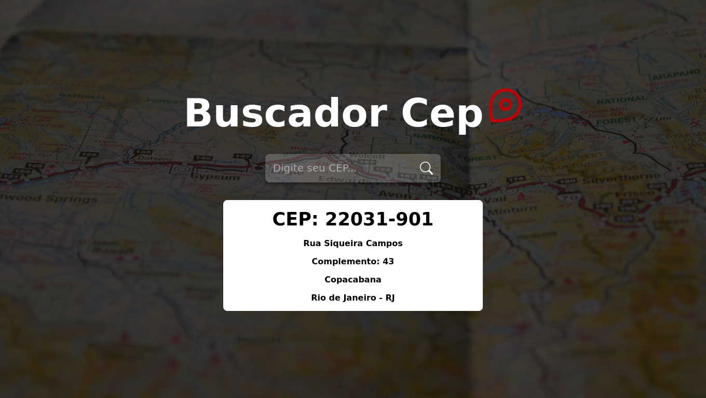

# Buscador de CEP 

## Projeto foi desenvolvido usando React


<br>




## Começando

<h4> Pré-requisitos</h4>

- Node 12
- Git 2

<h4>Instale o Projeto</h4>

```
git clone https://github.com/pamplona-c/buscador_de_cep.git
npm install
```

<h4>Inicie o servidor</h4>

```
  //in root
  npm start
```